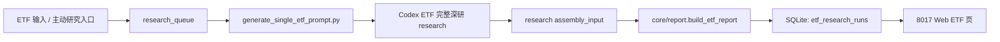

# 架构设计

## 目标

MyInvestETF 为单只 ETF 提供研究页面和只读 API，展示：

- 产品结构和跟踪指数
- 底层资产类别和组合角色
- 持仓披露、集中度和披露滞后
- 净值、价格、折溢价和底层指数估值位置
- ETF 类型化估值模型和五仓角色
- 流动性、份额变化和跟踪质量
- 底仓/工具仓资格
- ETF 历史研究记录

## 数据流



## 分层

- `myinvestetf/leader_index.py`：ETF 输入解析、投资暴露归类、同类成交额代表筛选、主动研究入队和提示词生成。
- `myinvestetf/db.py`：SQLite schema、队列状态机和研究记录入库。
- `myinvestetf/web.py`：只读 Web 页面和 JSON API。
- `core/schema/etf_report.py`：`ETFResearchReport` 强 schema。
- `core/valuation/classification.py`：ETF 类型识别，输出 `broad_index`、`mainline_theme`、`factor_defensive`、`cash_like`。
- `core/valuation/`：ETF 类型化估值、流动性、跟踪质量和仓位角色确定性评分。
- `core/report/`：确定性报告组装和 `report_hash`。
- `core/observability/`：旁路 trace 和审计日志。

## Web 路由

- `/`：ETF 首页。
- `/research?etf={code}`：主动研究入口。
- `/etfs/{code}`：ETF 详情页。
- `/api/index`：主结果接口。
- `/api/latest`：研究成果接口。
- `/api/etfs`：ETF 列表接口。
- `/api/etfs/{code}`：单只 ETF 详情接口。
- `/api/queue`：研究队列接口。

## 页面约束

所有页面底部统一加载：

```html
<script src="https://invest.okbbc.com/footer.js" defer></script>
```

Web 侧只读展示。主动研究入口只创建队列和跳转，不直接执行深研。

短融、日利、货币和现金类 ETF 被视为 `cash_like`，不进入深度研究队列，只做现金替代资格监控。
